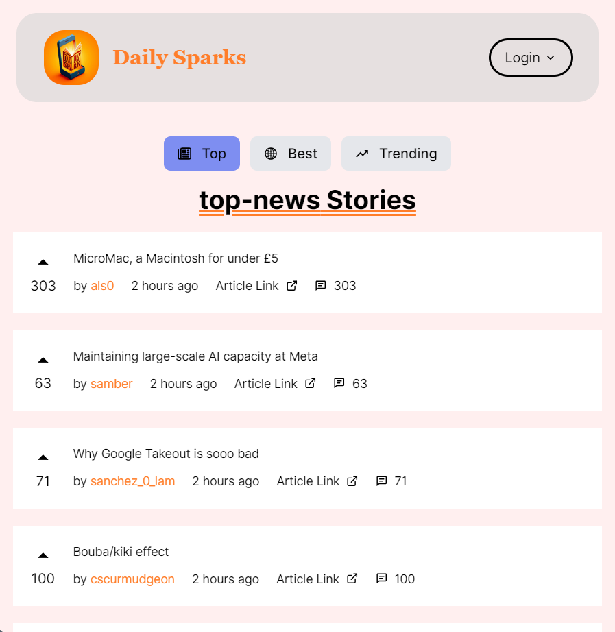

# Daily Sparks

.jpg)

## Table of contents

- [Overview](#overview)
  - [Screenshot](#screenshot)
  - [Links](#links)
  - [Tech Stack](#tech-stack)
- [Author](#author)


## Overview
  ### It is a News Website. It shows Different News Articles based on interest. Explore the World of News with Dail Sparks.

### Screenshot



### Links
**This is the link for Backend Code which serves News Articles**
- GitHub URL: [Code](https://github.com/sridhar-geek/DailySparks-Server)

**Visit Live website by clicking this Demo link**
- Site URL: [Demo](https://daily-spark.vercel.app/)

### Tech Stack
- Nextjs
- Tailwind Css
- HTML5
- CSS3
- JavaScript

## Setup/Installition
Clone the repository using this command
  ```sh
git clone https://github.com/sridhar-geek/Daily-Spark.git
```
Type these command in your teriminal after Cloning the Repository
 ```sh 
 npm install
npm run dev
 ```

## Author

- Linkdin - [Sridhar Moturu](https://www.linkedin.com/in/sridhar-moturu-b4620524b/)
